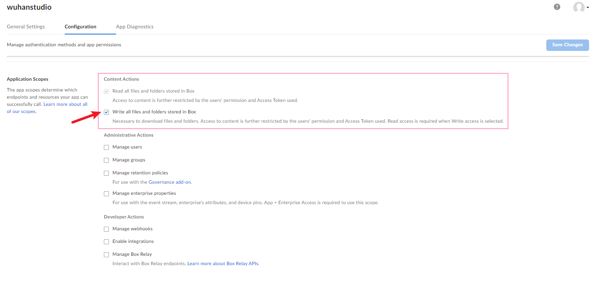

# Box API

> Automatically download dataset shared via Box Cloud.

For example, this autonomous driving dataset is shared via Box Cloud, and it is a pain to download each file manually.

[https://github.com/dotchen/LAV](https://github.com/dotchen/LAV)

You can change the shared link in `get_dataset.py`.

```
$ pip install boxsdk
$ python get_dataset.py

Enter developer token: YOUR_TOKEN_FROM_CONSOLE

Downloading: 158750948463 dataset
Total Folders: 1723
Folder 1 of 1723: aaehtgheqj
Folder 2 of 1723: abdiflkngs
```

The developer token can be found from the console (register and create a new App):

https://app.box.com/developers/console

Make sure you have write access selected in developer configurations.



#### References

- Box SDK (Python): https://github.com/box/box-python-sdk
- Box Developer: https://developer.box.com
- Box API: https://developer.box.com/reference/

```
$ pip install boxsdk
$ python get_dataset.py

Enter developer token: YOUR_TOKEN_FROM_CONSOLE

Downloading: 158750948463 dataset
Total Folders: 1723
Folder 1 of 1723: aaehtgheqj
Folder 2 of 1723: abdiflkngs
```

The developer token can be found from the console (register and create a new App):

https://app.box.com/developers/console

Make sure you have write access selected in developer configurations.


#### References

- Box SDK (Python): https://github.com/box/box-python-sdk
- Box Developer: https://developer.box.com
- Box API: https://developer.box.com/reference/
